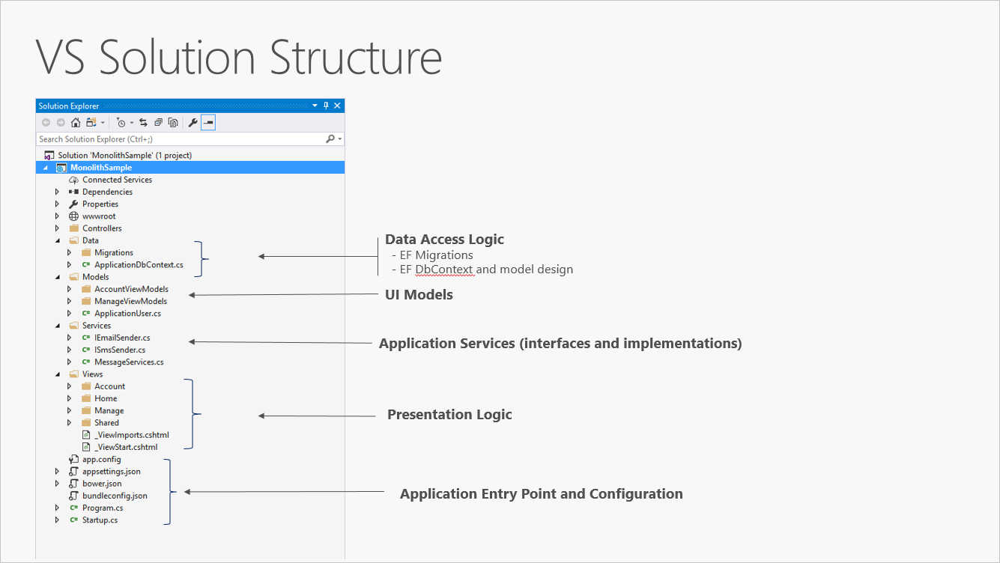

# Basic asp.net architecture

The simples architecture you can get is a small monolithic application. It contains all the application behaviour, presentation, business and data logic.

Separation of concern is acheived through folders.\
As the size of the project grows, this quickly becomes chaotic. To resolve this applications are evolved into multi-project solutions. Where each application is considered a layer, with it's own responsobility.

## Layers

Layers allow for logical separation within an application.\
With this architecture, applications can enforce restrictions on which layers are allowed to communicate, which helps to achieve encapsulation. This also makes it easier to change or replace layers.

Allows for reuse of low-level functionality throughout the application.