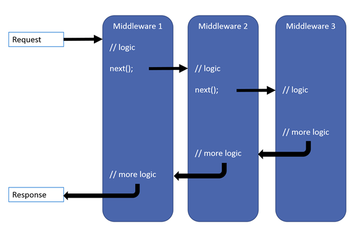
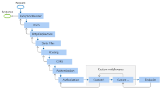

# Middleware

[Configure](projectSetup.md)
```
`Configure` defines the applications middleware pipeline. Each HTTP request received by the app will be processed by this pipeline, in order. To be able to use a middleware in this function, that is not available by default, it first has to be enabled in ConfigurationServices.\
Each middleware layer can make modifications and decide wheater to continue with the pipeline of exit early.\
Middleware is added to the pipeline by invoking `Use` extension methods.
```

Software that's assembled into a pipeline to handle requests and responses.\
The pipeline consists of request delatgates that are configured using Run, Map or Use extension methods in ConfigurationServices.

Each delegate can be specified in-line as an anonumous method, or by a reusable class. These, both methods, are middleware or middleware components. Each middleware compoent is responsible for invoking the next component in the popeline or short-circuite the pipeline. A short-circuit is called a terminal middleware, as it prevents futher middleware from processing the request. This is tyically done to prevent performing unnecessary work



### Next
`next` represents the next delegate in the pipeline. By not calling this parameter, the pipeline is short-circuited.\
It is possible to perform operations both before and after the next delegate. Even is a request is short-curcuit, the previously invoked delegates will run the actions they have after next.

```C#
var builder = WebApplication.CreateBuilder(args);
var app = builder.Build();

app.Use(async (context, next) =>
{
    // Do work that can write to the Response.
    await next.Invoke();
    // Do logging or other work that doesn't write to the Response.
});

app.Run(async context =>
{
    await context.Response.WriteAsync("Hello from 2nd delegate.");
});

app.Run();
```

### Run
`Run` delegates does not use Next. The first run delegate is always terminal and terminates the pipeline. Any run or use added after this is not called



## Custome middleware

Middleware is generally encapsulated in a class and exposed with an extension method. THis can be done inline or in a seperate class. 

A middleware class must include
- A public constructor with a parameter type RequestDelegate
- A public method `Invoke` or `InvokeAsync`. This must return a Task and take a first parameter `HttpContext`

```C#
public class RequestCultureMiddleware
{
    private readonly RequestDelegate _next;

    public RequestCultureMiddleware(RequestDelegate next)
    {
        _next = next;
    }

    public async Task InvokeAsync(HttpContext context)
    {
        // The middlware logic, do something
        var cultureQuery = context.Request.Query["culture"];
        if (!string.IsNullOrWhiteSpace(cultureQuery))
        {
            var culture = new CultureInfo(cultureQuery);

            CultureInfo.CurrentCulture = culture;
            CultureInfo.CurrentUICulture = culture;
        }

        // Call the next delegate/middleware in the pipeline.
        await _next(context);
    }
}
```

Typically the extension method is created to expose the middleware through `IApplicationBuilder` (used in Startup.cs's `Configure` method).

```C#
public static class RequestCultureMiddlewareExtensions
{
    public static IApplicationBuilder UseRequestCulture(
        this IApplicationBuilder builder)
    {
        return builder.UseMiddleware<RequestCultureMiddleware>();
    }
}

// Call in Configure
using Middleware.Example;
using System.Globalization;

var builder = WebApplication.CreateBuilder(args);
var app = builder.Build();

app.UseHttpsRedirection();

// Use middlware
app.UseRequestCulture();

app.Run(async (context) =>
{
    await context.Response.WriteAsync(
        $"CurrentCulture.DisplayName: {CultureInfo.CurrentCulture.DisplayName}");
});

app.Run();
```

## ASP.NET
