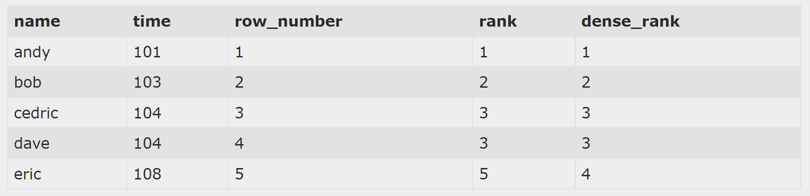
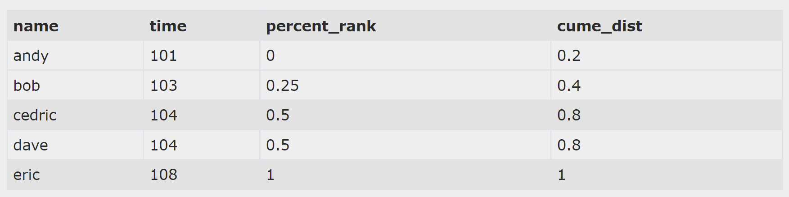

# Ranking

There are multiple built in functions that number rows based on a condition.

## Row_number

This is a built in window function that assigns a sequential integers to each row in the order of the ORDER BY clause within it's window. This does not affect the order of the final output as this is decided by the ORDER BY clause attached to the SELECT statement.

Simply: The affected row will be assigned its number in the `order by` list given the selected partition. (ex. Give a rank to each city depending on it's population size within it's given country).\
The selected partition can also be the entire result set.

Note: the row number given must always be unique!

```sql
SELECT 
   first_name, 
   last_name, 
   city,
   ROW_NUMBER() OVER (
      PARTITION BY city
      ORDER BY first_name
   ) row_num
FROM sales.customers
ORDER BY city;
```


## Rank
The same as `row number` except when two rows have the same value they will be given the same rank. The next row will then be given the rank appropriate to its position, disregarding the two common values(see picture).

## Dense_rank
The same as `rank` except when two rows have the same value they will be given the same rank. The next row will then be given the **NEXT rank**.

```sql
 SELECT name, time,
 row_number() over (order by time),
 rank() over (order by time),
 dense_rank() over (order by time)
 FROM runners order by time
```



# Relative rank

Calculates the relative rank of a group of rows.

## Percent_rank

Returns a number between 1 and 0. 1 being the highest. Two rows with the same value will get the same rank.

### Display out of 100%

```sql
SELECT name, weight, percent_rank() over (order by weight) * 100 percent
from cats 
order by weight
```

## Cume_dist

Returns a number from 1 to 0, but never 0. Two rows with the same value will get the same rank.

```sql
SELECT name, time,
percent_rank() over (order by time),
cume_dist() over (order by time)
FROM runners order by time
```

