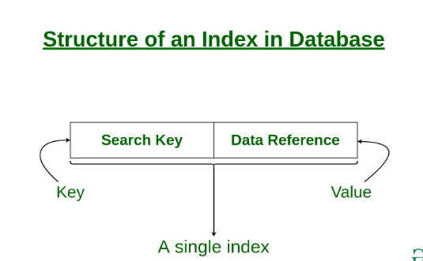
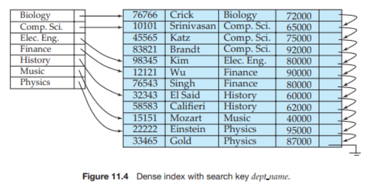
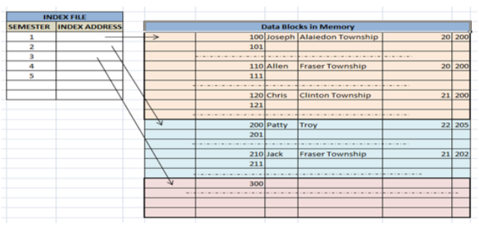
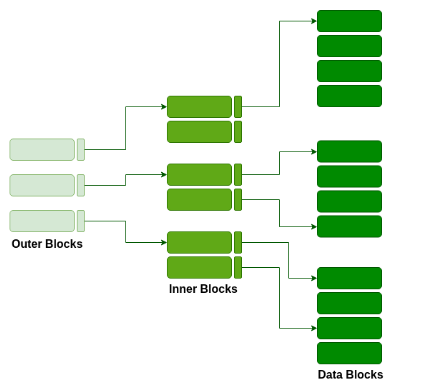

# Indexes

The purpose of indexes is to optimize performance by minimizing the number of disk accesses required when a query is processed.

An index contains of a search key (a copy of the primary key or the chosen index value for the table. These are stored in sorted order) and a data reference/pointer to the disk block of the key value.

Index attributes:
- Access types: type of access (search, range etc.)
- Assess time: time needed to find data element
- Insertion time: time taken to find appropriate space and insert new data
- Deletion time: Time to find item and delete/update index structure
- Spave overhead: Additional space required by the index

## Ordered index files

Based on a sorted ordering of values. Fast and more traditional storing mechanism

### Dense index

There is an index record for every search key value in the data file. The record contains the search key and a reference to the first data record with that search key value.

### Sparce index

The index only hold records for a few items in the data file, each pointing to a block. To locate a record we find the index record with the largest value, closest to our desired result (larg but smaller than the record or equal to the record). We start at the indexed record and process until we find the desired record.

## Hash file organization

Values are distributed in buckets according to a hash function.

### Clustered indexing

Records with similar characteristics are grouped together on disks and indexes are created for these groups.

Multiple records related to the same thing are stored in the same file. These files are ordered on non-key fields. Clusters may be created non-primary keys columns that do not have to be unique for each record. These will be grouped together and we will create an index on them.

### Non-clustered/secondary indexing

This index tells you where the data lies using pointers/references to where the data is actually stored.

The data is not physically stored in order of the index, this means we have to have dense ordering. Ass all records have to be represented.

The fact that we only have a pointer, not the actual data, means that this requires more time than a clustered index.

### Multilevel indexing

With a lot of data, the index size also grows and might become to large to store in a single level. This index separates the index into smaller blocks which in turn point to the data blocks where the data is available.

