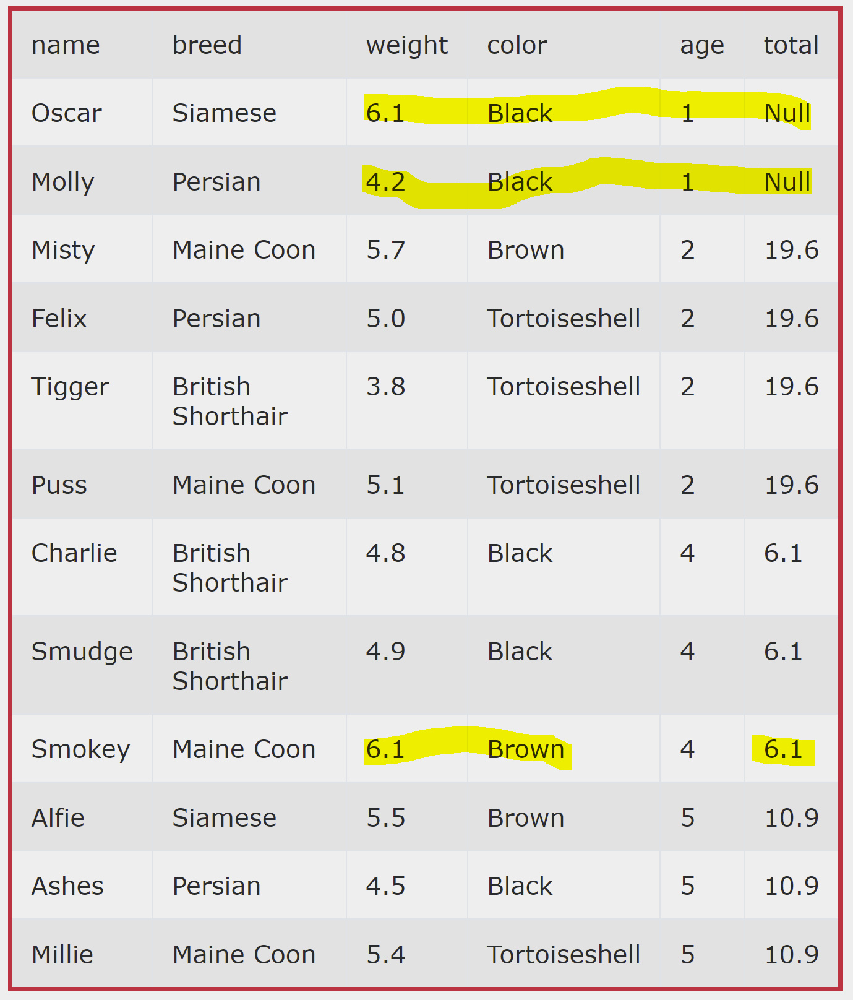

# Filter

Only rows that return true for the filter expression are used in the window. The aggregation window still returns a value for every row, but the expressions that do not pass the filter are not included in the window frame for any row.

Example: calculate the total weight of cats grouped by age. Do not include the weight of black cats.
```sql
select *, sum(weight) filter (where color != 'Black') over (partition by age) total
from cats
order by age
```
