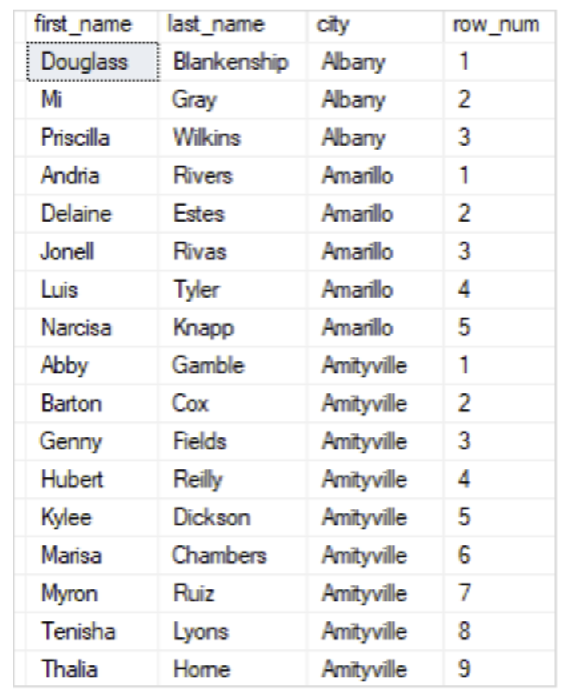

# Number rows

There are multiple built in functions that number rows based on a condition.

## Row_number

This is a built in window function that assigns a sequential integers to each row in the order of the ORDER BY clause within it's window. This does not affect the order of the final output as this is decided by the ORDER BY clause attached to the SELECT statement.

Simply: The affected row will be assigned its number in the `order by` list given the selected partition. (ex. Give a rank to each city depending on it's population size within it's given country).\
The selected partition can also be the entire result set.

```sql
SELECT 
   first_name, 
   last_name, 
   city,
   ROW_NUMBER() OVER (
      PARTITION BY city
      ORDER BY first_name
   ) row_num
FROM sales.customers
ORDER BY city;
```

