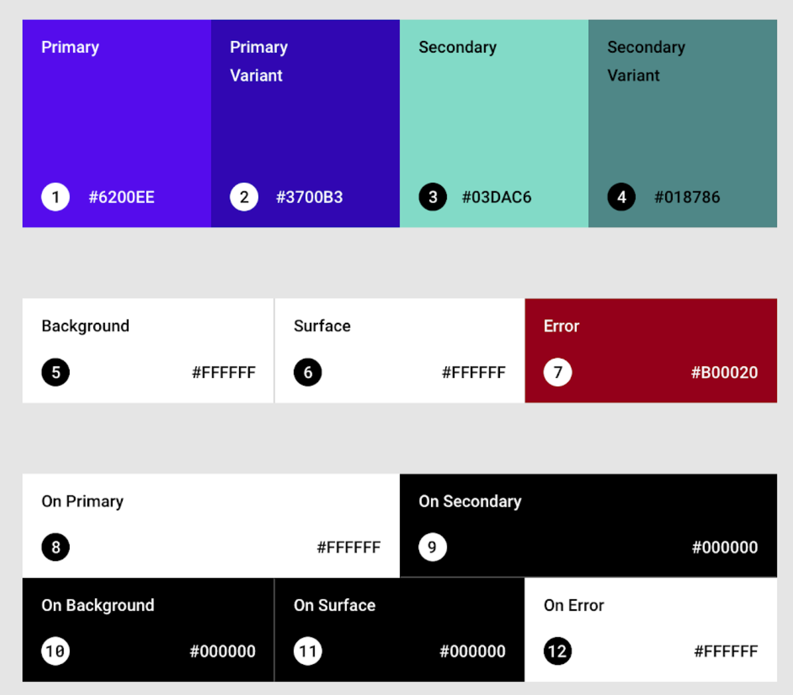
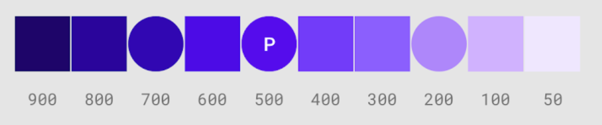

# Colors

Access material colors by typing `Colors.` and then select the color and variant you want. The default variant when not specified is [500].
You can also add **custom colors**:

```dart
Color.fromRGBO();
Color.fromARGB();
Color(0xff)         // insert HEX
```

These are the default theme colors provided by flutter.



Try the material color interface [tool](https://material.io/resources/color/#!/?view.left=0&view.right=0).

## Primary

The most used color in the application. Use this often and it's variants to distinguish between different components in the application.


The larger the number that follows the color, the darker the shade: `Colors.amber[500]`



## Secondary

Use sparcly, for elements that are supposed to stand out, if you don't want to use a primary variant.

## Other color consepts

**Surface**: Affects surfaces of components: cards, sheets, menues

**Background**: Displays behind scrollable content

**Error**: used for text and text fields

## "On" colors

These refer to elements that appear on top on a primary, secondary, background, surface or error color. For example text in an elevated button. The color of the button is primary, while the text is onPrimary.