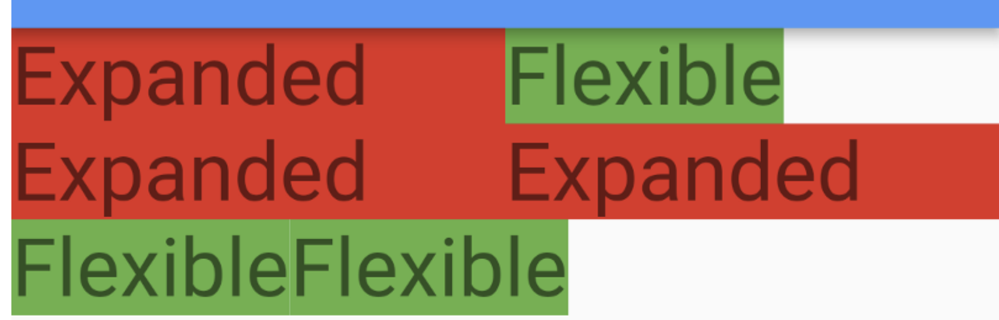

# Flexible

Works much like flexbox for web.

A Flexible widget is similar to Expanded, however it only takes up as much space as it needs, unlike Expanded.



If multiple children of set widget are Flexible, the space is devided evenly, or according to the `flex` property assigned.

```dart
Column(
      children: [
        Flexible(
            flex: 2
            child: Center(
              child: Text("Harry is here!",
                 key: Key('main_text'), style: TextStyle(fontSize: 28)),
        )),
        Flexible(
          flex: 3,
          child: Container(),
        ),
```