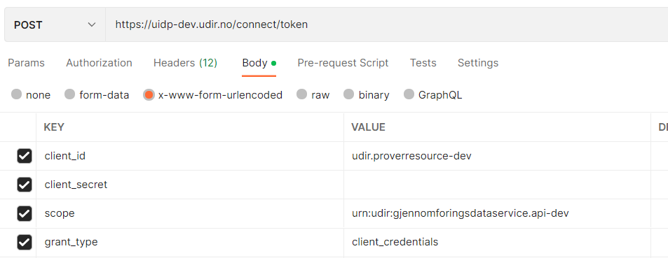
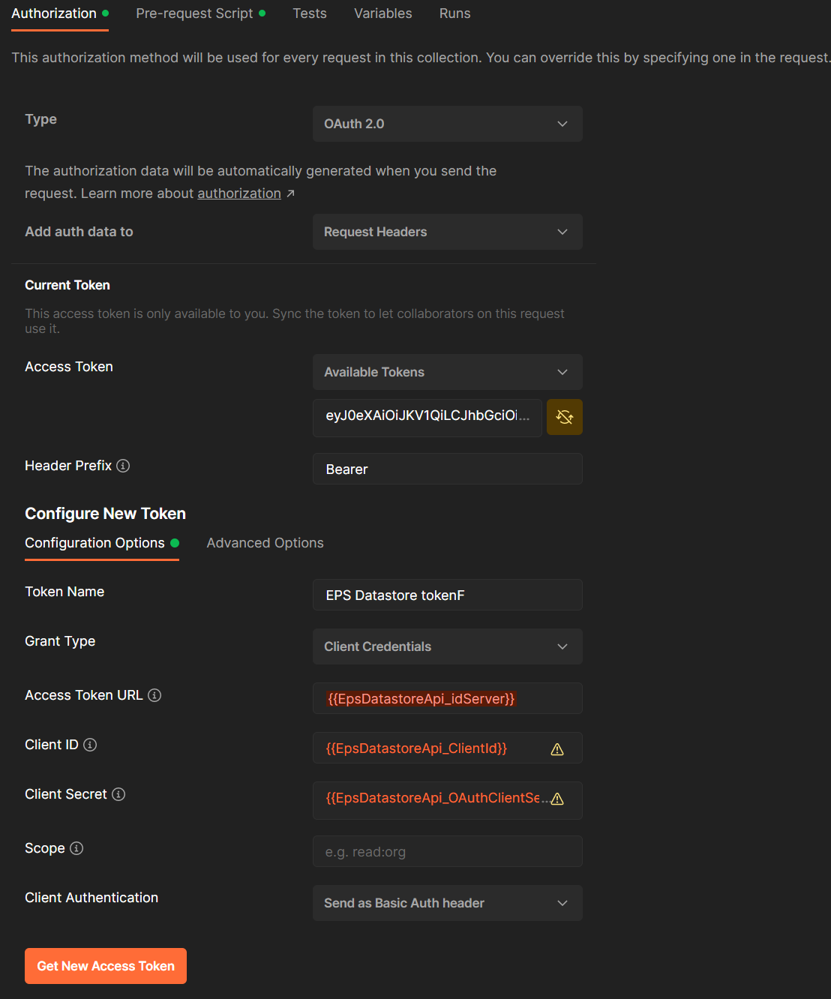

# Authentization

Some times we need permission to access an API. We do this by adding authorization.

There are many ways to do this.

## Request to get bearertoken

Add the parameters needed in the body of the request.



Copy the request bearer token and paste it in the request you want to send under Authorization - Bearer token

## From parent

You can also `inherit authentization` from your parent, the collection.

There are two ways to do this:

## Authentication tab on collection

Set up value to get the bearer token in the collection.\
By doing this you ask for the bearer token once for all requests in the collection that has the Authorization tab value `Inherit auth from parent`.

Remember to ask for and use a new token when it's been a while since last time!



## Prerequest script

Can be used directly on the query or added to the whole collection.

A prerequest script is run before the request, and sets the token value. You have to refer to the token value in the request Authorization in order for this to work. Choose `Bearer token` and set the variable name of whichever variable you saved the token to.

NB: this request will run every time you rerun your request. In some cases this might not be prefered.

Where pm.environment.get gets the current environment variable for the provided key.\
Saves value to the variable `ACCESS_TOKEN`
```js
const postRequest = {
  url: pm.environment.get("Eps_idServer"),
  method: 'POST',
  timeout: 0,
  header: {
    "Content-Type": "application/x-www-form-urlencoded"
  },
  body: {
    mode: 'urlencoded',
    urlencoded: [
        {key: "grant_type", value: "client_credentials"},
        {key:"client_id", value: pm.environment.get("EpsDatastoreApi_ClientId")},
        {key:"client_secret", value: pm.environment.get("EpsDatastoreApi_OAuthClientSecret")},
    ]}
};

pm.sendRequest(postRequest, function (err, res) {
    var responseJson = res.json();
    console.log(responseJson);
    pm.environment.set('ACCESS_TOKEN', responseJson['access_token']);
});
```